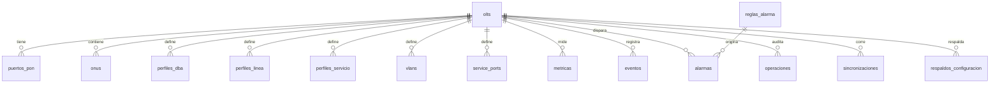

# Modelo de datos

Base **propia** del módulo. No reutiliza ninguna tabla de Pucará: la integración futura
será por servicios, no compartiendo tablas. Definiciones en
[`database/schema_sqlite.sql`](../database/schema_sqlite.sql) y
[`database/schema_postgres.sql`](../database/schema_postgres.sql), con los mismos nombres
de tabla y columna en ambos motores.

Toda marca de tiempo se guarda en **UTC**.

## Mapa

## Tablas

### Inventario

| Tabla | Clave natural | Notas |
|---|---|---|
| `olts` | `host` | Incluye las credenciales **cifradas** en columnas propias |
| `puertos_pon` | `(olt_id, indice)` | Temperatura y voltaje por SFP de PON |
| `onus` | `(olt_id, pon, onu_id)` | La identidad es la **posición**, no el serial |

**Por qué la identidad de una ONU es su posición y no su número de serie.** El serial no
siempre está disponible: en VSOL no viene por SNMP (verificado en Fase 0). Además una ONU
puede reemplazarse manteniendo su posición y su cliente. El serial tiene índice para
búsquedas, pero no es único a nivel global, a propósito: eso permite conservar el histórico
de una ONU que migra de OLT.

Consecuencia práctica, ya cubierta por el repositorio: **una lectura sin serial no borra el
serial conocido.** Sin esa protección, cada lectura rápida por SNMP en una VSOL vaciaría el
campo.

### Perfiles y servicios

`perfiles_dba`, `perfiles_linea`, `perfiles_servicio`, `vlans`, `service_ports`.

Son un **espejo** de lo que tiene la OLT: el equipo es la verdad y la base es la copia
consultable. Por eso se reemplazan como conjunto en una transacción, en vez de acumular
altas sueltas. Un perfil borrado en el equipo que sobreviva en la base termina ofrecido en
la interfaz al autorizar una ONU, y el comando falla contra el equipo.

### Histórico

`metricas` guarda todas las series: RX/TX de ONU y de OLT, temperatura, voltaje, distancia,
CPU, memoria, tráfico, errores.

**El problema de volumen y cómo se resuelve.** Con 473 ONU en una sola OLT y sondeo cada 5
minutos, una tabla plana llega a ~50 millones de filas al año. La retención es escalonada:

| Granularidad | Retención | Contenido |
|---|---|---|
| `fina` | 7 días | cada muestra |
| `horaria` | 90 días | promedio, mínimo, máximo y cantidad de muestras |
| `diaria` | 730 días | ídem |

La granularidad es una **columna**, no una tabla: agregar y depurar es un
`INSERT … SELECT` seguido de un `DELETE`, sin migrar nada. En PostgreSQL, `metricas` es
además candidata natural a particionado por rango sobre `registrada_en`.

`valor_minimo` y `valor_maximo` se guardan junto al promedio porque en potencias ópticas el
promedio esconde justo lo que importa: una ONU que cae a −31 dBm dos veces por día promedia
bien y aun así tiene un problema.

### Trazabilidad

| Tabla | Para qué |
|---|---|
| `eventos` | Cambios detectados: ONU nueva, ONU eliminada, cambio de estado, de potencia, de firmware, de perfil |
| `operaciones` | **Auditoría de escrituras**: quién, cuándo, qué comandos, qué contestó el equipo |
| `sincronizaciones` | Cada corrida, con resultado `completa` / `parcial` / `fallida` |
| `alarmas` + `reglas_alarma` | Alarmas con umbral, severidad e histéresis |
| `respaldos_configuracion` | `running-config` con hash, para detectar cambios |

**`operaciones` también registra lo simulado.** Una intención registrada vale tanto como
una ejecución: sirve para revisar qué se iba a hacer antes de hacerlo.

**Las contraseñas nunca entran en `comandos`.** Los drivers las enmascaran antes de
devolver el resultado. La auditoría no puede convertirse en un depósito de credenciales.

**`sincronizaciones.resultado` distingue tres cosas distintas:**

- `completa` — se leyó todo.
- `parcial` — se leyó parte. Lo que falta **no** se da por inexistente.
- `fallida` — no se pudo leer nada. Tampoco prueba que no haya nada.

Esa distinción es la que evita repetir la baja masiva falsa que ya ocurrió en producción.

### Seguridad

Las credenciales de OLT se guardan cifradas con Fernet (`cryptography`), en columnas
`*_cifrado`. La clave viene de `GPON_CLAVE_CIFRADO` y nunca se guarda en la base. Sin clave
configurada, el módulo no arranca.

Si la clave se pierde, las credenciales guardadas son irrecuperables y hay que volver a
cargarlas. Es el costo aceptado de no tenerlas en claro.

## Versionado

`esquema_version` guarda la versión aplicada. `inicializar_esquema()` es idempotente:
se puede ejecutar sobre una base existente sin efecto. Las migraciones con cambios de
estructura llegan en `database/migrations/` cuando haya una segunda versión.
